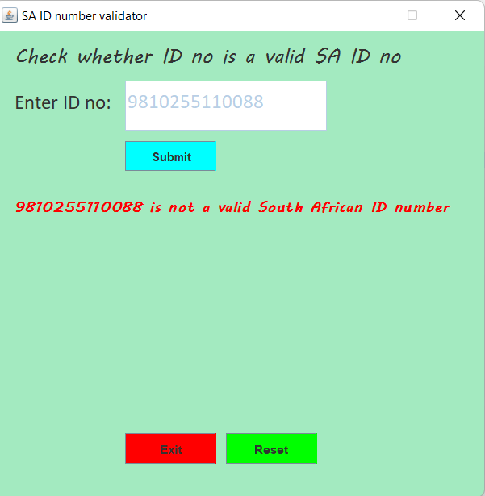
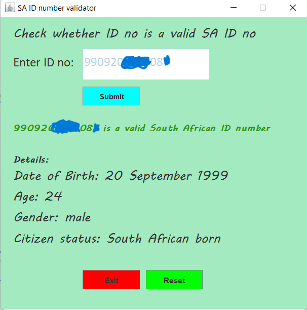

# South African ID number validator(SAIDno validatior)

SAIDno validator is a desktop application that validates if an ID number is a valid South African Identity number.

## How to use
```
Enter ID number in the textfield
click submit

if ID number entered is a valid South African ID number, The screen will display text in green and
details of the ID number enter will appear below

otherwise if will display text in red responding to the enterd number
```

To exit the application user needs to enter exit or click the close icon in the top right corner of the application. If the user wants to check another number, click the reset button.

<br/><br/>




